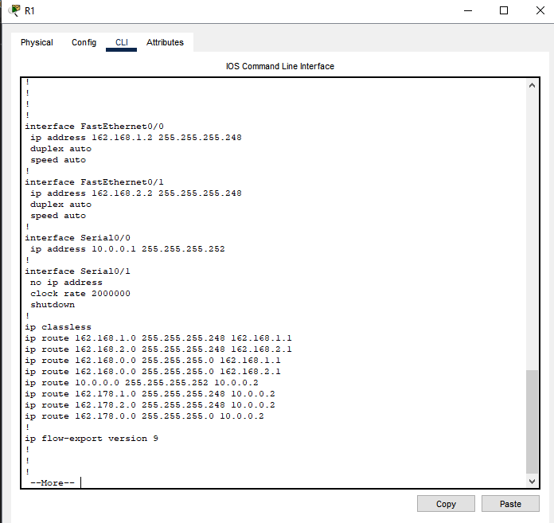
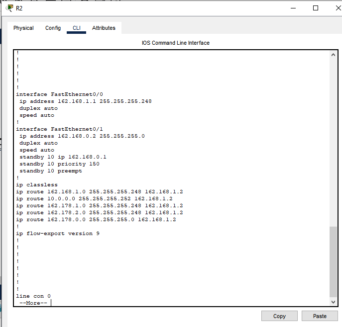
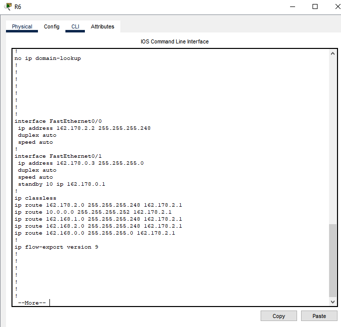
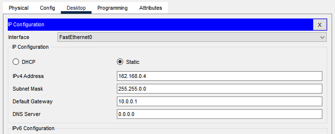
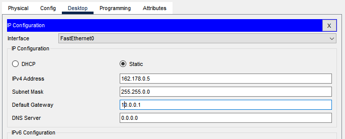
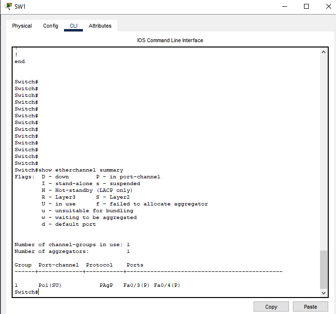
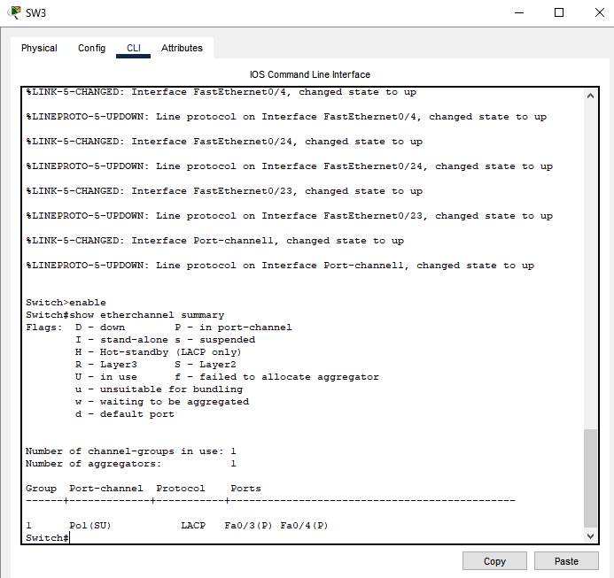

# Manual Tecnico
Gerhard Ardon - 202004796
---

## Configuracion de los routers
Para el R1
```
enable
conf t
hostname R1
do wr

int s0/0
ip address 10.0.0.1 255.255.255.252
no shut
interface f0/0
ip address 162.168.1.2 255.255.255.248
no shut
interface f0/1
ip address 162.168.2.2 255.255.255.248
no shut
do wr
```

Para R2 
```
enable
conf t
hostname R2
do wr

interface f0/0
ip address 162.168.1.1 255.255.255.248
no shut
interface f0/1
ip address 162.168.0.2 255.255.255.0
standby 10 ip 162.168.0.1   
standby 10 priority 150
standby 10 preempt
no shut

do wr
```

Para R3
```
enable
conf t
hostname R3
do wr

interface f0/0
ip address 162.168.2.1 255.255.255.248
no shut
interface f0/1
ip address 162.168.0.3 255.255.255.0
standby 10 ip 162.168.0.1  
no shut
do wr
```

Y se repite lo mismo para el otro lado 

A continuacion se presentan capturas de la configuracion de los sw, los routers y las VPC

R1

R2


R6



Vpc 11


Vpc 14


Sw1

Sw3


## Comandos para 
**Creacion static routes**
```
IP route

enable
configure terminal

ip route 162.168.1.0 255.255.255.248 162.168.1.1
ip route 162.168.2.0 255.255.255.248 162.168.2.1
ip route 162.168.0.0 255.255.255.0 162.168.1.1
ip route 162.168.0.0 255.255.255.0 162.168.2.1
ip route 10.0.0.0 255.255.255.252 10.0.0.2
ip route 162.178.1.0 255.255.255.248 10.0.0.2
ip route 162.178.2.0 255.255.255.248 10.0.0.2
ip route 162.178.0.0 255.255.255.0 10.0.0.2
do write
```

**creacion portchanel**
```
enable
conf t
interface range fa0/3 - 4
channel-group 1 mode desirable
exit
interface port-channel 1
switchport mode trunk
exit
do wr


enable
configure terminal
interface range fa0/3 - 4
channel-group 1 mode auto
exit
interface port-channel 1
switchport mode trunk
exit
do wr 
```

```
enable
configure terminal
interface range fa0/3 - 4
channel-group 1 mode active
exit
interface port-channel 1
switchport mode trunk
exit
do wr


enable
configure terminal
interface range fa0/3 - 4
channel-group 1 mode passive
exit
interface port-channel 1
switchport mode trunk
exit
do wr
```

**creaccion ipvirtual**
```
enable
conf t
hostname R2
do wr

interface f0/0
ip address 162.168.1.1 255.255.255.248
no shutdown

interface f0/1
ip address 162.168.0.2 255.255.255.0
standby 10 ip 162.168.0.1   
standby 10 priority 150
standby 10 preempt
no shutdown
do wr
```

## Comandos para verificar (sh)
`sh running-config`
`sh ip route`
`sh standby`